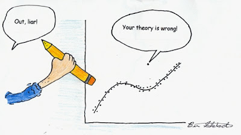

# Portfolio

Repository containing portfolio of Data Science, Machine Learning, Algorithms projects completed by me for scientific and self learning purposes. 
I'm still in the process of describing finished projects and uploading them here.

## Data Science | Machine Learning

### Methods Overview

<blockquote>
In this section you can find Jupyter Notebooks with overview of different methods. They cover some of the most important topics of Machine Learning. You can check the comparison based on my datasets or use the notebooks to pick the right method for your dataset.
</blockquote>

#### Data Exploration

#### Data Engineering

#### Feature Selection

[Notebook](https://github.com/ppapiez/Portfolio/blob/master/Feature%20selection.ipynb) contains overview of different Feature Selection methods:
* Filter Methods (Pearson’s Correlation, LDA, Anova, Chi-Square, Variance Threshold, Information Gain (Mutual Information)
* Wrapper Methods (Recursive Feature Elimination (RFE), Boruta)
* Embedded Methods (Lasso Regression, Ridge Regression, Logistic Regression, Elastic Net, Random Forest, LightGBM, XGBoost, CatBoost)

#### Dimensionality Reduction

### Simple Projects

### Scientific Projects

#### Reinforcement Learning

#### Master Thesis: Comparison of Convolutional Neural Networks and Capsule Neural Networks

## Python programming | Algorithms

## Applied AI

### Azure

-----

  

